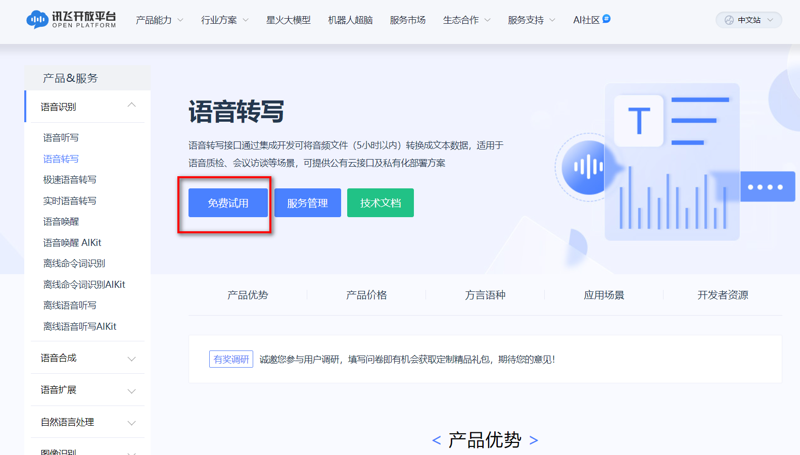
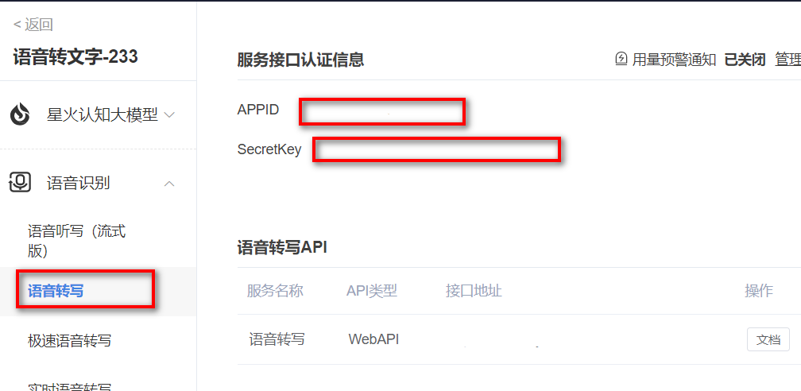
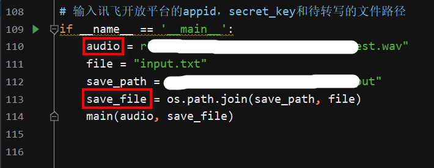

## 讯飞语音转文字

### 申请api
#### 地址：https://www.xfyun.cn/services/lfasr
如图，个人开发者可以免费申请5个小时的用量。

### 环境配置
python 3.6
### 使用方式
1. main.py中添加自己的appid和secret_key
   
   <pre>
    def main(audio, output):
        api = RequestApi(appid="在此处添加",
                         secret_key="在此处添加",
                         upload_file_path=audio)
    '''
    </pre>
2. 确认好录音文件的目录位置，win系统记得使用r前缀
   
3. ```python main.py``` 运行
   - orderResult字段是识别的结果，字符串类型，具体解析方法如下：
   <pre>
   # 得到的识别结果
   order_result = api.get_result()
   order_result = order_result['content']['orderResult']
   json_dict = json.loads(order_result)
   json_dict = json.loads(json_dict['lattice'][0]['json_1best'])
   json_list = json_dict['st']['rt'][0]['ws']
   for i in range(len(json_list)):
       final_text += json_list[i]['cw'][0]['w']
   </pre>
